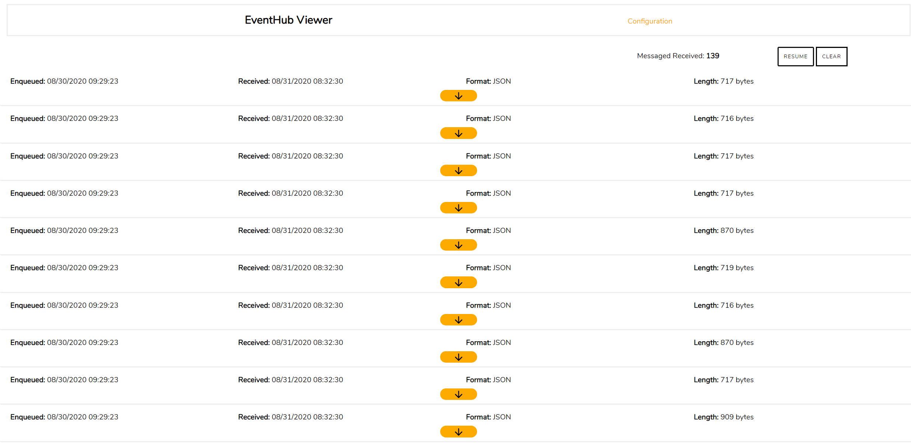
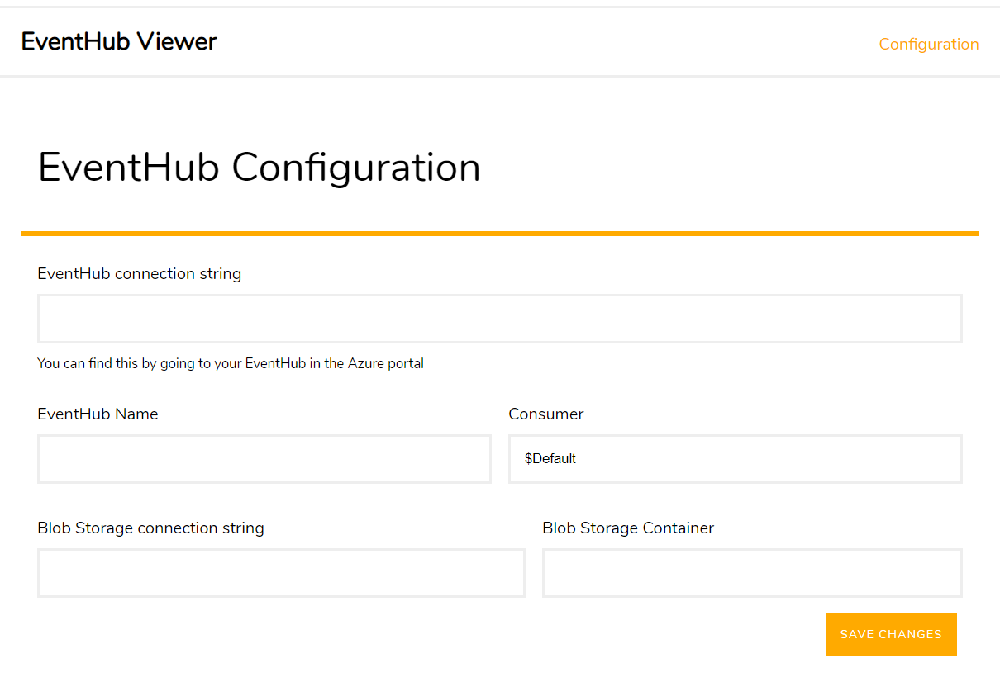

# EventHub Viewer

This is a simple web based application to receive and display incoming events from [Azure Event Hubs.](https://azure.microsoft.com/en-gb/services/event-hubs/)



## Getting Started

The optimal way to get up and running quick is to use the latest [Docker image.](https://hub.docker.com/repository/docker/tomg/eventhubviewer) Simply run the following command in your terminal to grab and run the latest version.

```
docker run -d -p 5000:80 tomg/eventhubviewer:latest
```

Once you have done this you can navigate to localhost:5000 where the app should be up and running. Then go to the configuration page and fill in the details of your EventHub Connection.

